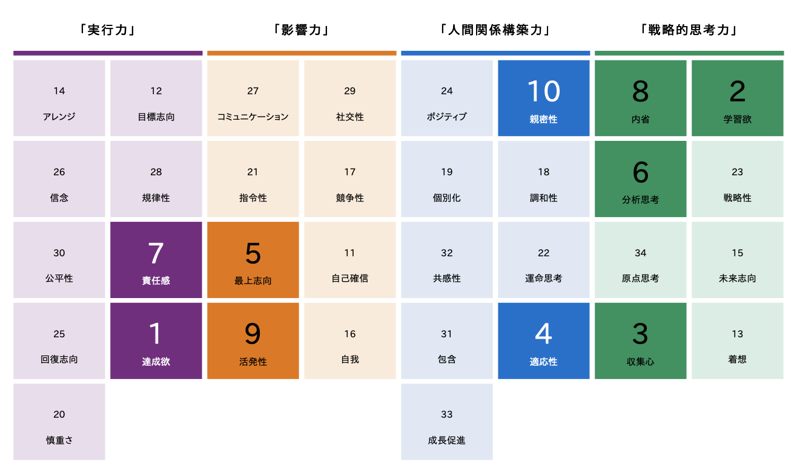

 
    <a href="./README.md">English</a> | 日本語

## 自己紹介

* [Github](https://github.com/kokoichi206)
* [履歴書](./resume.md)
* [職務経歴書](./work_experience.md)

### やりたいこと

- しばらくは開発者として、自分でもコードを書く時間も取りたいと思っています。
- 最終的にはテックリードのように、技術的な側面から貢献していきたいです。
- プロダクトのフェーズとしては 0→1 を経験してみたいです。

#### できれば避けたいこと

- 技術に触れないことがストレスでフラストレーションが溜まってしまいます。

### 伸ばしていきたいスキル

- 英語
- システム設計力
    - 技術の選定基準を持つ
- 運用面（ログ解析など）

## 技術的に興味があること

- mobile, サーバーサイドなどに縛られない、よいアーキテクチャとは
- Jetpack Compose (Android)
- KMM などのクロスプラットフォーム開発
- Go とその周辺技術
    - マイクロサービスのアーキテクチャ

### いつかやってみたいこと

技術的な領域に関しては、いつか 0 から理解したいという思いがあります。

- 低レイヤーの理解
    - OS 自作
- 得意な分野を作る
- Database の理解
    - RDB を作る

## 考えていること

- どんどん新しいことをやっていきたい

### モットー

- 俺の敵はだいたい俺です
- 無駄なことをしないと合理的になれない

## 性格とか

### クリフトンストレングス34

### グッドポイント診断（マイナビ）

- 独創性
- 親密性
- 挑戦心
- 決断力
- 悠然
