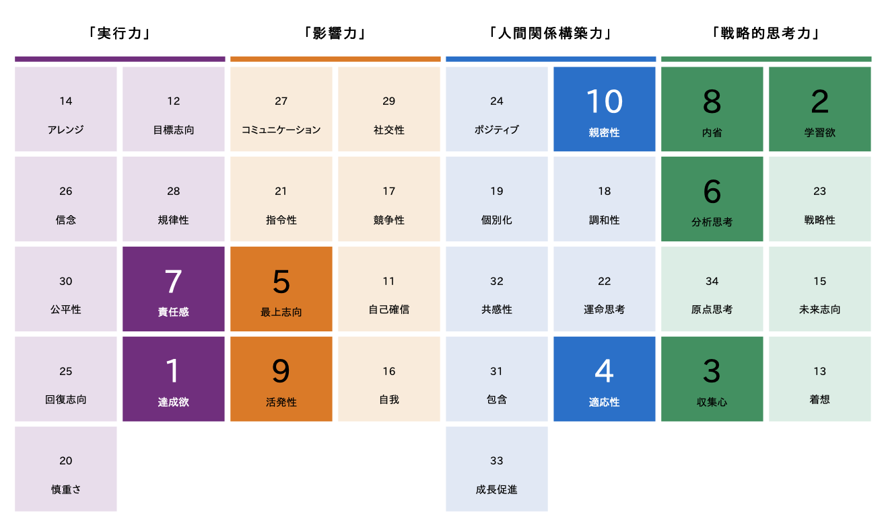

 
    English | <a href="./README.ja.md">日本語</a>

## About Me

* [Link to Github](https://github.com/kokoichi206)
* [Work experience](./work_experience_en.md)

### Skills To Develop

- English skills
- System design
- Operational aspects (e.g., log analysis)

## Technical Interests

- Architecture
- Jetpack Compose (Android)
- Cross-platform development (like KMM)
- Go and its related technologies
  - Microservice architecture

### Want to Try Someday

- Understanding Low-level concepts
  - Building an operating system from scratch
- Specializing in a specific field
- Understanding database management system

## Thoughts

- I wanna keep trying new things

### Motto

- All art is quite useless.
- Perfection is achieved, not when there is nothing more to add, but when there is nothing left to take away.
- Done is better than perfect.

## Personality and Traits

### CliftonStrengths 34

