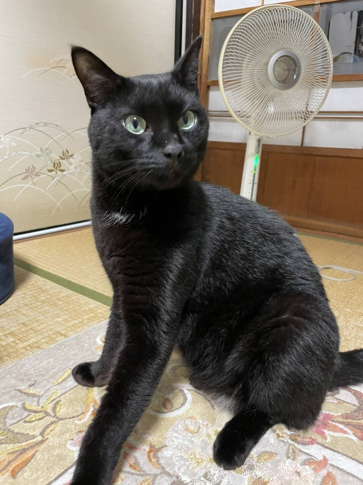

# 履歴書

\<YY> 年 \<MM> 月 \<DD> 日現在

## 基本情報

### 氏名

冨永 貴弘（とみなが　たかひろ）

### 生年月日

1995 年 6 月 30 日生 （満 \<Age> 歳）

### 住所

〒 012 - 3456
東京都名無区秘密町

## 連絡先

### 携帯電話

080-6xxx-xxx5

### E-mail

chotto.himitu@gmail.com

## 経歴

| 年 | 月 | 
学歴・職歴
 |
| :---: | :---: | :--- |
|  |  |  |
||| 
学歴
 |
| 2014 | 3 | 山口県立徳山高校 卒業 |
| 2015 | 4 | 京都大学理学部 入学 |
| 2019 | 3 | 京都大学理学部 卒業 |
| 2019 | 4 | 京都大学理学研究科 入学 |
| 2021 | 3 | 京都大学理学研究科 卒業 |
|  |  |  |
|  |  | 
職歴
 |
| 2021 | 4 | 株式会社 OPTiM 入社 |
| 2024 | 5 | Repro 株式会社入社 |
|  |  | 現在に至る |

| 年 | 月 | 
免許・資格
 |
| :---: | :---: | :--- |
| 2017 | 9 | 普通自動車免許 |
| 2021 | 3 | 日商簿記３級 |
| 2022 | 3 | [AWS ソリューションアーキテクトアソシエイト(SAA)](https://aws.amazon.com/jp/certification/certified-solutions-architect-associate/) |
| 2022 | 10 | [IPA 応用情報技術者試験](https://www.ipa.go.jp/shiken/kubun/ap.html) |
| 2023 | 1 | [JSSC 統計検定準１級](https://www.toukei-kentei.jp/exam/grade1semi/) |
| 2023 | 4 | [IPA ネットワークスペシャリスト試験](https://www.ipa.go.jp/shiken/kubun/nw.html) |
| 2023 | 10 | [IPA データベーススペシャリスト試験](https://www.ipa.go.jp/shiken/kubun/db.html) |
|  |  | 
以上
 |

## 備考

- [credly](https://www.credly.com/users/takahiro-tominaga.5cd0b374)
